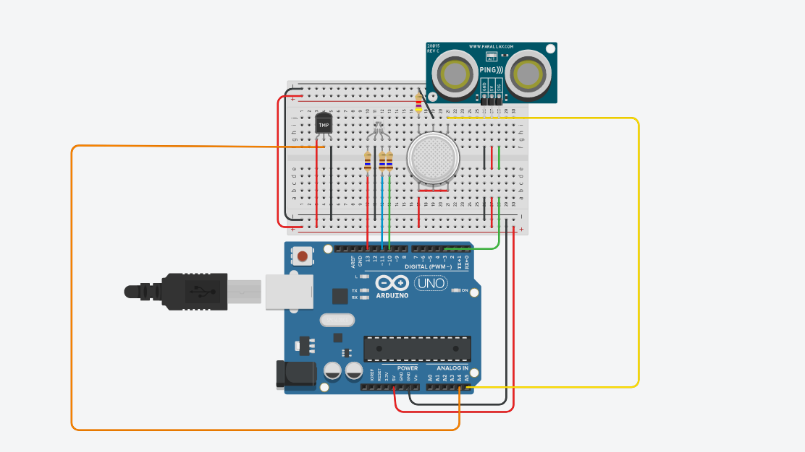

# Circuit Challenge 
# Where and why was it developed?
System developed in c++ for arduino during the practice of computer systems and security. Developed with the aim of encouraging and unlocking programmatic logic.

# Picture of the circuit

